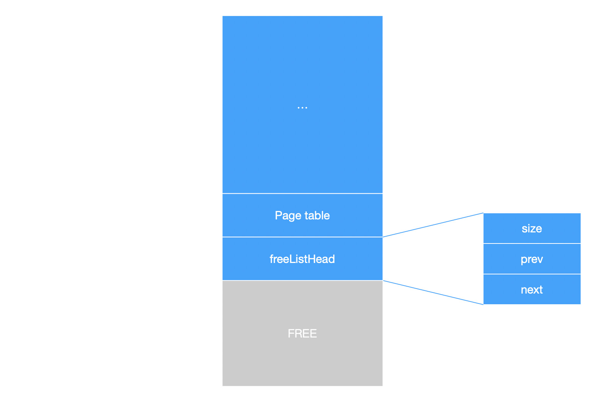
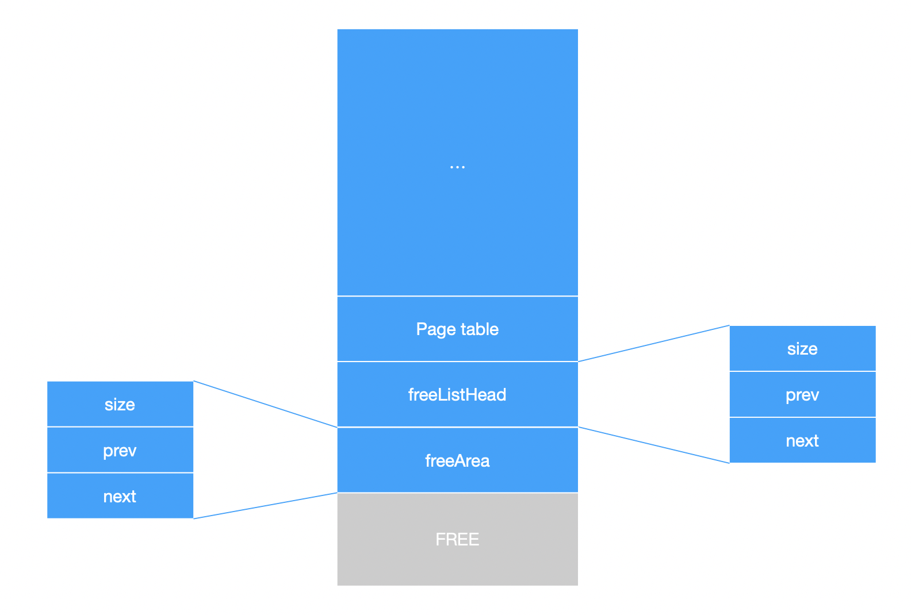
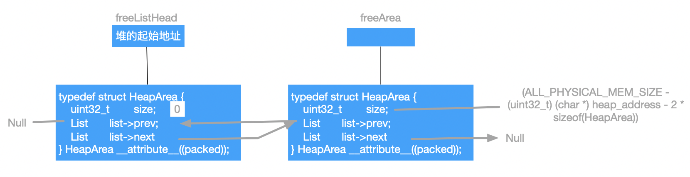
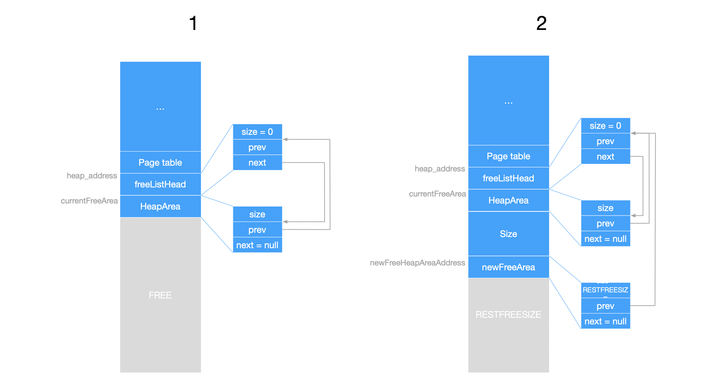
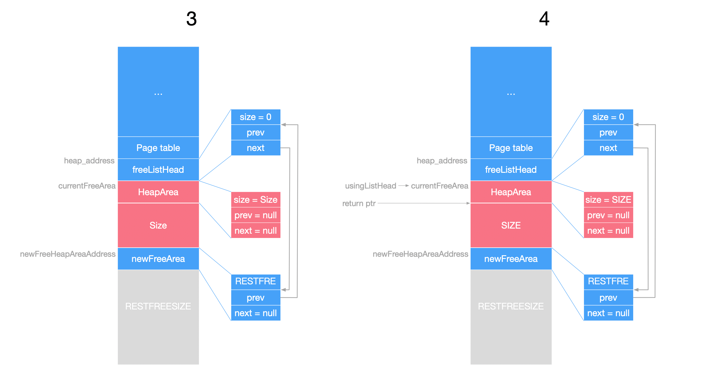
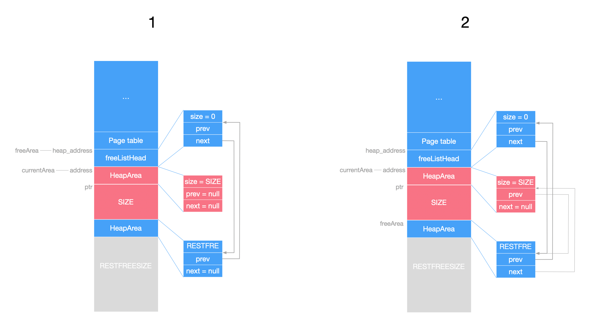
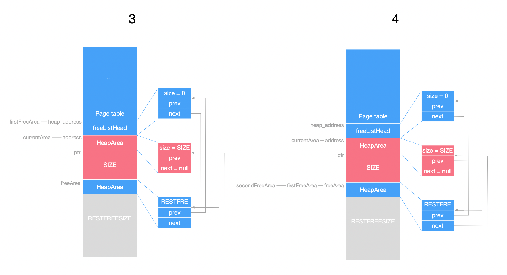

中文版

本篇文档介绍 SynestiaOS 中内核态内存堆的管理，涉及到堆的初始化、堆分配和堆的回收。SynestiaOS 中的堆是通过List链表管理的，关于List的介绍可以跳转[这里]()。堆的定义位于`SynestiaOS/SourceCode/Kernel/include/kheap.h` 和 `SynestiaOS/SourceCode/Kernel/include/kheap.c` 。


### 基础数据结构

每一个堆使用如下结构体抽象：

```c
typedef struct HeapArea {
  uint32_t size;
  ListNode list;
} __attribute__((packed)) HeapArea;
```

- size代表该段堆的大小是多少
- list字段将所有的堆连接成为一个链表，用于管理


堆管理中，定义了两个全局指针：

```c
HeapArea *usingListHead;
HeapArea *freeListHead;
```

- `usingListHead` 将所有分配了的堆空间连接成一个链表。
- `freeListHead` 将所有的空闲的堆空间连接成一个链表。


### 堆的初始化

堆的初始化代码如下：

```c
KernelStatus kheap_init() {
  kheap_set_alloc_callback(default_heap_alloc_func);
  kheap_set_free_callback(default_heap_free_func);

  uint32_t heapAddress = (uint32_t)&__HEAP_BEGIN;
  LogInfo("[KHeap] end bss at: %d. \n", heapAddress);

  uint32_t heapPhysicalPage =
      (uint32_t)page_alloc_huge_at(USAGE_KERNEL_HEAP, (heapAddress | 4 * KB) >> VA_OFFSET, 128 * MB - heapAddress);
  LogInfo("[KHeap] alloc heap page: %d. \n", (uint32_t)heapPhysicalPage);

  heapAddress = KERNEL_PHYSICAL_START + heapPhysicalPage * PAGE_SIZE;
  LogInfo("[KHeap] kheap at: %d. \n", heapAddress);

  freeListHead = (HeapArea *)heapAddress;
  freeListHead->size = 0;
  freeListHead->list.prev = nullptr;

  HeapArea *freeArea = (HeapArea *)(heapAddress + sizeof(HeapArea));
  freeArea->size = (ALL_PHYSICAL_MEM_SIZE - (uint32_t)(char *)heapAddress - 2 * sizeof(HeapArea)); // all memory
  freeListHead->list.next = &freeArea->list;
  freeArea->list.next = nullptr;
  freeArea->list.prev = &freeListHead->list;

  usingListHead = nullptr;

  return OK;
}
```

- 首先获取 `heap` 堆的起始地址，在内存分配的文档中可以知道页表之后的剩余的物理内存就全部是堆的空间了，起始地址是 `__HEAP_BEGIN`。

- 之后标记物理页面，因为堆的空间是页表之后到内核空间完毕的所有空间，所以需要标记的物理页面的大小是 `128 * MB - heapAddress`，标记使用的类型是 `USAGE_KERNEL_HEAP` ，标记大小为 `128 * MB - heapAddress`。

- 后面的计算`heapAddress = KERNEL_PHYSICAL_START + heapPhysicalPage * PAGE_SIZE;`的结果也就是 `__HEAP_BEGIN`了。

- 之后全局的 `freeListHead` 指向 `__HEAP_BEGIN`，`freeListHead`的类型是 `HeapArea *`，接着就初始化 `size` 字段和 `list` 字段。此时内存的布局如下：

  

- 从上图中可以看出来最下面的 `FREE` 区域就全部是空闲的堆空间了，于是接下来就定义一个 `freeArea` 来管理这块内存，它的起始地址从上图中可以看出是 `heap_address` 再往下偏移一个 `HeapArea` 的大小；由于又使用了一个 `freeArea` 来管理这块内存区域，所以size大小就是所有剩余的物理内存大小减去两个 `HeapArea`。此时的内存布局如下：

  

  两个 `HeapArea` 的结构关系如下：

  

- 管理好这一大块内存之后，就将这块内存连接到 `freeListHead` 链表上。因为这里是一开始的堆的初始化，所以没有使用的堆，就将 `usingListHead` 设置为 `nullptr`。

  

### 堆的分配

类似于Linux内核的`kmalloc`函数功能，堆分配的函数如下：

```c
void *kheap_alloc(uint32_t size) {
  uint32_t allocSize = size + sizeof(HeapArea);

  if (freeListHead == nullptr) {
    printf("[KHeap]: failed to get freeListHead.\n");
    return nullptr;
  }

  HeapArea *currentFreeArea = freeListHead;
  while (currentFreeArea != nullptr) {
    // if the size of the free block can contain the request size and a rest HeapArea, then just use it, and split a new
    // block
    if (currentFreeArea->size >= allocSize) {
      // 1. split a rest free HeapArea
      uint32_t newFreeHeapAreaAddress = (uint32_t)(void *)currentFreeArea + sizeof(HeapArea) + size;
      uint32_t restSize = currentFreeArea->size - allocSize;

      HeapArea *newFreeArea = (HeapArea *)newFreeHeapAreaAddress;
      newFreeArea->size = restSize;

      // 2.link new free heap area to free list
      newFreeArea->list.prev = currentFreeArea->list.prev;
      newFreeArea->list.next = currentFreeArea->list.next;
      currentFreeArea->list.prev->next = &newFreeArea->list;
      if (currentFreeArea->list.next != nullptr) {
        currentFreeArea->list.next->prev = &newFreeArea->list;
      }

      // 3. link this to using list
      currentFreeArea->list.prev = nullptr;
      currentFreeArea->list.next = nullptr;
      currentFreeArea->size = size;
      HeapArea *usingArea = usingListHead;
      if (usingArea == nullptr) {
        usingListHead = currentFreeArea;
      } else {
        while (usingArea->list.next != nullptr) {
          usingArea = getNode(usingArea->list.next, HeapArea, list);
        }
        usingArea->list.next = &currentFreeArea->list;
        currentFreeArea->list.prev = &usingArea->list;
      }

      // 4. return the ptr of the using block
      void *ptr = (void *)currentFreeArea + sizeof(HeapArea);
      if (heapFreeFunc == nullptr) {
        default_heap_alloc_func(ptr, size);
        return ptr;
      }
      heapAllocFunc(ptr, size);
      return ptr;
    }
    currentFreeArea = getNode(currentFreeArea->list.next, HeapArea, list);
    // no free block found ,it's means we must do some memory defragmentation
    // todo: defragmentation
  }
  return nullptr;
}
```

- 接收的参数是要分配的堆空间的内存大小size。
- 实际上要分配给堆的内存空间是 `size` 加上一个 `HeapArea` 结构的大小，因为每一块heap内存都需要一个 `HeapArea` 结构来管理。
- 接下来在 `freeListHead` 链表中寻找空闲的堆空间，如果剩余的堆空间大小比要分配的堆空间 `size` 加上一个`HeapArea` 结构要大，就直接分配一块空间。
- 接下来把剩余的空闲堆空间放入到空闲堆链表中，并把分配走的堆空间放入到 `usingListHead` 链表中。
- 目前还没有实现内存碎片整理。

详细的过程如下：






### 堆的回收

堆空间的 `free` 函数：

```c
KernelStatus kheap_free(void *ptr) {
  // 1. get HeapArea address
  uint32_t address = (uint32_t)(ptr - sizeof(HeapArea));
  HeapArea *currentArea = (HeapArea *)address;

  // 2. unlink from using list
  if (currentArea->list.prev != nullptr) {
    currentArea->list.prev->next = currentArea->list.next;
  }

  if (currentArea->list.next != nullptr && currentArea->list.prev != nullptr) {
    currentArea->list.next->prev = currentArea->list.prev;
  }

  // 3. link this to free list
  HeapArea *freeArea = freeListHead;
  while (freeArea->list.next != nullptr) {
    freeArea = getNode(freeArea->list.next, HeapArea, list);
  }
  currentArea->list.prev = &freeArea->list;
  currentArea->list.next = freeArea->list.next;
  freeArea->list.next = &currentArea->list;

  // do some merge stuff, between two adjacent free heap area
  HeapArea *firstFreeArea = freeListHead;
  while (firstFreeArea->list.next != nullptr) {
    firstFreeArea = getNode(firstFreeArea->list.next, HeapArea, list);
    HeapArea *secondFreeArea = firstFreeArea;
    while (secondFreeArea->list.next != nullptr) {
      secondFreeArea = getNode(secondFreeArea->list.next, HeapArea, list);

      // check is adjacent free heap area
      if (firstFreeArea + sizeof(HeapArea) + firstFreeArea->size == secondFreeArea) {

        // resize the first heap area
        firstFreeArea->size = firstFreeArea->size + sizeof(HeapArea) + secondFreeArea->size;
        firstFreeArea->list.next = secondFreeArea->list.next;
        secondFreeArea->list.next->prev->next = &firstFreeArea->list;

        // delink the second heap area
        secondFreeArea->list.prev = nullptr;
        secondFreeArea->list.next = nullptr;
        secondFreeArea->size = 0;
      }
    }
  }

  if (heapFreeFunc == nullptr) {
    default_heap_free_func(ptr);
    ptr = nullptr;
    return OK;
  }

  heapFreeFunc(ptr);
  ptr = nullptr;
  return OK;
}

```

- 传送的参数是要分配的堆空间的起始地址。
- 先将这段堆空间从 `usingListHead` 上删除掉。
- 将这段堆空间连接到 `freeListHead` 上。
- 之后进行连续内存空间合并。

详细过程如下：






### 堆的重分配

方法为 `kheap_realloc` ：

```c
void *kheap_realloc(void *ptr, uint32_t size) {
  // 1. alloc new heap area
  void *newHeapArea = kheap_alloc(size);

  // 2. copy the data from old heap area to new heap area
  HeapArea *oldHeapArea = ptr - sizeof(HeapArea);
  uint32_t dataSize = oldHeapArea->size;
  memcpy(newHeapArea, ptr, dataSize);

  // 3. free old heap area
  kheap_free(ptr);
  return newHeapArea + sizeof(HeapArea);
}
```

应用场景是堆不够用的时候，需要重新分配堆，把之前堆内存中的内容先 `memcpy` 到新的`HeapArea`中，然后释放掉旧的`HeapArea`，最后返回新的堆的起始地址。


### 堆的Count分配

方法为 `kheap_calloc` ：

```c
void *kheap_calloc(uint32_t num, uint32_t size) { return kheap_alloc(num * size); }
```

这个方法是要分配 `num * size` 大小的堆空间。即调用 `kheap_alloc` 函数即可。


### 堆按alignment对齐分配：

例如在分配栈的时候就需要8字节对齐，方法为`kheap_alloc_aligned`：

```c
void *kheap_alloc_aligned(uint32_t size, uint32_t alignment) {
  uint32_t offset = alignment - 1 + sizeof(void *);
  void *p1 = kheap_alloc(size + offset);
  if (p1 == nullptr) {
    return nullptr;
  }
  void **p2 = (void **)(((uint32_t)p1 + offset) & ~(alignment - 1));
  p2[-1] = p1;
  return p2;
}
```


