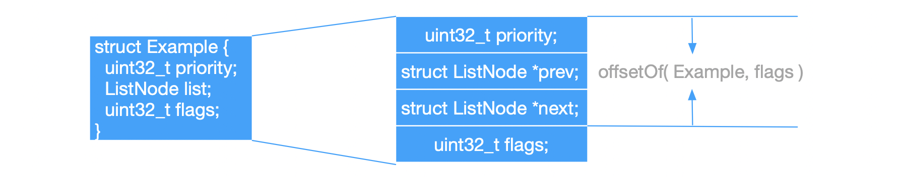
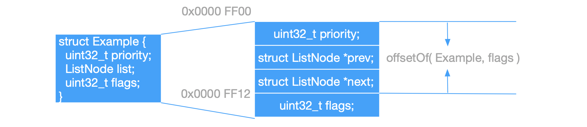

中文版

链表是 SynestiaOS 使用最多的数据结构，和传统的链表不同，它作为一个成员存在于某一个类中。链表的定义位于`SynestiaOS/SourceCode/Kernel/include/list.h` 和 `SynestiaOS/SourceCode/Kernel/include/list.c` 。


### 链表定义

链表定义如下：

```c
typedef struct ListNode {
  struct ListNode *prev;
  struct ListNode *next;
} __attribute__((packed)) ListNode;
```

链表必须配合如下两个宏才能发挥出它的威力，类似于Linux内核中的 container_of 宏 ：

```c
#define offsetOf(type, member) (char *)(&(((type *)0)->member))
#define getNode(ptr, type, member) ((type *)((char *)(ptr) - (char *)(&(((type *)0)->member))))
```

- `offsetof`宏用于获取 type 结构体中 member成员的偏移地址：

  - 以 `struct Example` 为例介绍该宏的使用，下图是`struct Example`结构体，右边是该结构体在实际内存中的存储形式。

    

  - `offsetOf(Example, flags)` 用于获取 `flags` 在 `Example` 结构体中的偏移地址，目前SynestiaOS运行于ARM32上，所以指针占用的大小为4个字节，所以得到的 `flags` 在 `Example` 中的偏移是12个字节。

- `getNode`宏中，`ptr`是结构体成员变量的地址，`type`是该结构体的类型，member是该结构体成员变量名，该宏的作用是利用该结构体成员的地址得到该结构体成员所在结构体的起始地址。

  - `getNode`宏的后半部分减去的正是 `offsetOf(type, member)`，还是以 `struct Example` 为例介绍：

    

  - 假设我们知道 `flags` 的起始地址，`&flags` 是 `0x0000 FF12`，那么使用 `getNode(&flags, Example, flags)` ，也就是利用 `flags` 的起始地址减去它在 `struct Example` 中的偏移就可以算出来 `flags` 所在的 `struct Example` 实例的起始地址，是 `0x0000 FF00`。

### 链表方法

1. 将 `node` 节点插入到 `list` 链表中：

   ```c
   KernelStatus klist_insert(ListNode *list, ListNode *node) {
     if (list->next != nullptr) {
       list->next->prev = node;
       node->next = list->next;
     }
     node->prev = list;
     list->next = node;
   }
   ```

   

2.  将 `node` 节点插入到 `list` 尾部，尾插法：

   ```c
   KernelStatus klist_append(ListNode *list, ListNode *node) {
     ListNode *tmp = list;
     while (tmp->next != nullptr) {
       tmp = tmp->next;
     }
     node->prev = tmp;
     tmp->next = node;
   }
   ```


3. 得到 `node` 节点所在 `list` 的头结点：

   ```c
   ListNode *klist_get_head(ListNode *node) {
     ListNode *first = node;
     while (first->prev != nullptr) {
       first = first->prev;
     }
     return first;
   }
   ```


4. 把 `node` 节点从 `node` 所在 `list` 中删除：

   ```c
   ListNode *klist_remove_node(ListNode *node) {
   
     if (node->next == nullptr && node->prev == nullptr) {
       return node;
     }
   
     if (node->next == nullptr && node->prev != nullptr) {
       node->prev->next = nullptr;
       node->prev = nullptr;
       return node;
     }
   
     if (node->prev == nullptr && node->next != nullptr) {
       node->next->prev = nullptr;
       node->next = nullptr;
       return node;
     }
   
     ListNode *prev = node->prev;
     ListNode *next = node->next;
   
     prev->next = next;
     next->prev = prev;
   
     node->next = nullptr;
     node->prev = nullptr;
   
     return node;
   }
   ```


5. 计算 `node` 所在 `list` 有多少个节点：

   ```c
   uint32_t klist_size(ListNode *node) {
     ListNode *first = node;
     while (first->prev != nullptr) {
       first = first->prev;
     }
   
     uint32_t size = 1;
     while (first->next != nullptr) {
       first = first->next;
       size++;
     }
   
     return size;
   }
   ```

   