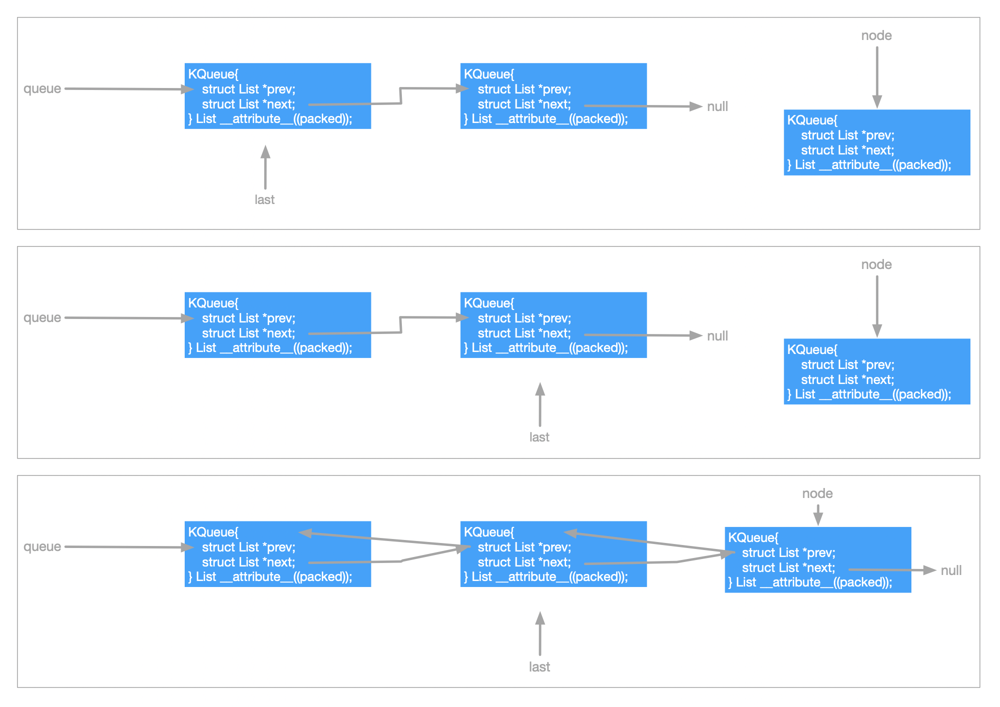
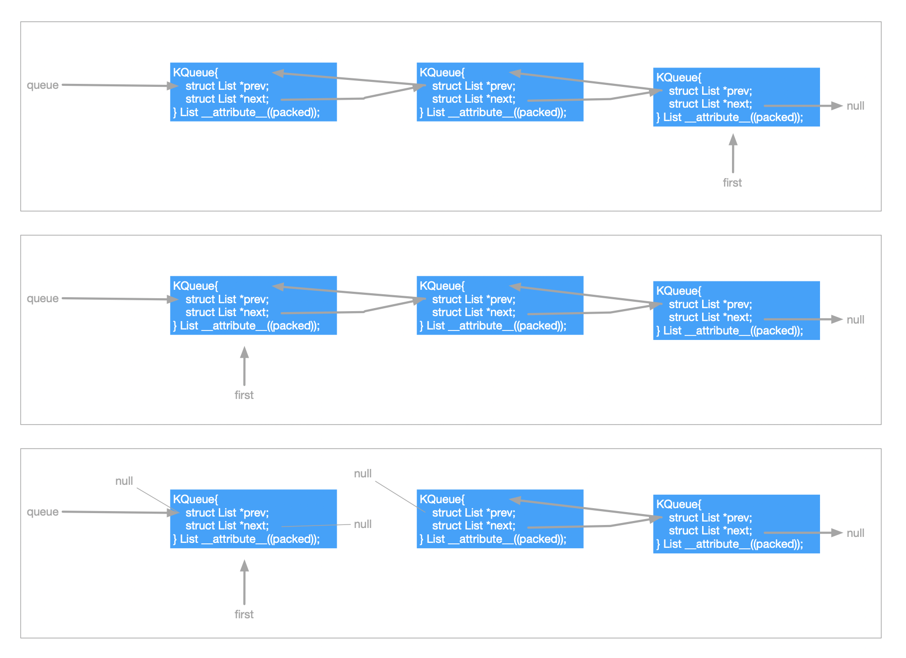

中文版

SynestiaOS 中的队列结构是在 `List` 链表结构基础上开发的，关于List的介绍可以跳转[这里]()。队列的定义位于`SynestiaOS/SourceCode/Kernel/include/kqueue.h` 和 `SynestiaOS/SourceCode/Kernel/include/kqueue.c` 。


### 队列定义

队列定义如下：

```c
typedef ListNode KQueue;
```

- SynestiaOS在List的基础上，对方法做了限制从而实现队列。


### 队列方法

1. 入队，队列只能从队尾入队，所以将 `node` 节点插入到 `queue` 的尾部，如果成功返回OK：

   ```c
   KernelStatus kqueue_enqueue(KQueue *queue, KQueue *node) {
     KQueue *last = queue;
     if (last == nullptr) {
       queue = node;
       node->prev = nullptr;
       node->next = nullptr;
     }
     while (last->next != nullptr) {
       last = last->next;
     }
     last->next = node;
     node->prev = last;
     node->next = nullptr;
   
     return OK;
   }
   ```

   入队的过程如下图：

   


2. 出队，队列只能从队头出队，出队成功后，会把出队的节点地址返回

   ```c
   KQueue *kqueue_dequeue(KQueue *queue) {
     KQueue *first = queue;
     while (first->prev != nullptr) {
       first = first->prev;
     }
     first->next->prev = nullptr;
     first->next = nullptr;
     first->prev = nullptr;
     return first;
   }
   ```

   出队的过程如下图：

   


3. 求队列长度

   ```c
   uint32_t kqueue_size(KQueue *queue) { return klist_size(queue); }
   ```

   由于队列使用 `List` 实现，所以返回队列长度也就是返回链表的长度了。


