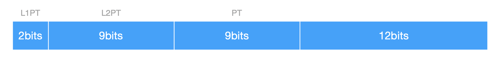
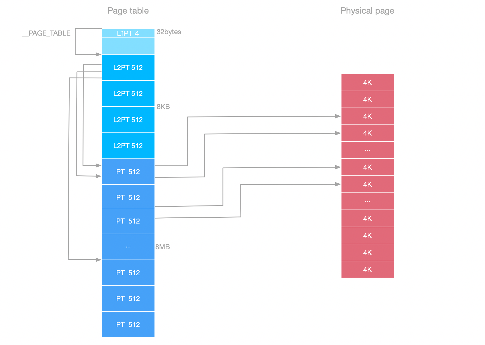

中文版

本篇文档介绍 SynestiaOS 的页表分配、内存页表初始化等工作。

内存部分的代码位于`SynestiaOS/SourceCode/Kernel/Arch/arm/vmm/include/page.h`、`SynestiaOS/SourceCode/Kernel/Arch/arm/vmm/include/vmm.h`、`SynestiaOS/SourceCode/Kernel/Arch/arm/vmm/src/page.c`、`SynestiaOS/SourceCode/Kernel/Arch/arm/vmm/src/vmm.c`中

其中会在`SynestiaOS/SourceCode/Kernel/src/init.c`的主函数中进行开始内存的初始化工作。

## 页表的划分

SynestiaOS 启用了ARM处理器的[LAPE](https://elinux.org/images/6/6a/Elce11_marinas.pdf)模式，根据硬件手册，`SynestiaOS` 的页目录项的划分如下：



`SynestiaOS` 目前工作在32位模式，**页表**的大小是4KB`(#define PAGE_SIZE 4 * KB)`，**页表项**是64位，一共有三级页表，**[31:30]**表示一级页表，**[29:21]**表示二级页表，**[20:12]**表示三级页表；表示内存的方式为：`4(2^2) × 512(2^9) × 512(2^9) × 4KB = 4GB`。 

32位可以寻址的内存范围是4GB(2^32)，所以4GB的内存一共需要4GB / 4KB个物理页面：

```c
SynestiaOS/SourceCode/Kernel/Arch/arm/vmm/src/page.c

#define PHYSICAL_PAGE_NUMBERS (1 << 20)
```

`SynestiaOS` 目前支持的内存大小为512MB，内核空间和用户空间按照1:3划分，所以**内核空间**占用128MB，**用户空间**占用384MB。所以在代码中会有如下宏，一级页表映射4个，二级页表只映射64个，所以表示内存的方式为：`4 × 64 × 512 × 4KB = 512MB`。

```c
SynestiaOS/SourceCode/Kernel/Arch/arm/vmm/include/page.h

#define KERNEL_L1PT_NUMBER 4
#define KERNEL_L2PT_NUMBER 64
#define KERNEL_PTE_NUMBER 512
```

根据硬件手册，页目录项的定义如下：

```c
SynestiaOS/SourceCode/Kernel/Arch/arm/vmm/include/page.h

typedef struct PageTableEntry {
  /* These are used in all kinds of entry. */
  uint64_t valid : 1; /* Valid mapping */
  uint64_t table : 1; /* == 1 in 4k map entries too */

  /* These ten bits are only used in Block entries and are ignored in Table entries. */
  uint64_t ai : 3;   /* Attribute Index */
  uint64_t ns : 1;   /* Not-Secure */
  uint64_t user : 1; /* User-visible */
  uint64_t ro : 1;   /* Read-Only */
  uint64_t sh : 2;   /* Shareability */
  uint64_t af : 1;   /* Access Flag */
  uint64_t ng : 1;   /* Not-Global */

  /* The base address must be appropriately aligned for Block entries */
  uint64_t base : 28; /* Base address of block or next table */
  uint64_t sbz : 12;  /* Must be zero */

  /* These seven bits are only used in Block entries and are ignored in Table entries. */
  uint64_t hint : 1;  /* In a block of 16 contiguous entries */
  uint64_t pxn : 1;   /* Privileged-XN */
  uint64_t xn : 1;    /* eXecute-Never */
  uint64_t avail : 4; /* Ignored by hardware */

  /* These 5 bits are only used in Table entries and are ignored in Block entries */
  uint64_t pxnt : 1; /* Privileged-XN */
  uint64_t xnt : 1;  /* eXecute-Never */
  uint64_t apt : 2;  /* Access Permissions */
  uint64_t nst : 1;  /* Not-Secure */
} __attribute__((packed)) PTE;
```

一级页表的定义如下，一共有4项：

```c
SynestiaOS/SourceCode/Kernel/Arch/arm/vmm/include/page.h

typedef struct Level1PageTable {
  PTE pte[KERNEL_L1PT_NUMBER];		// KERNEL_L1PT_NUMBER 为 4
} L1PT;
```

二级页表的定义如下，一共有512项，只映射64项：

```c
SynestiaOS/SourceCode/Kernel/Arch/arm/vmm/include/page.h

typedef struct Level2PageTable {
  PTE pte[KERNEL_PTE_NUMBER];			//KERNEL_PTE_NUMBER 为 512
} L2PT;
```

三级页表的定义如下，一共有 `512 × 512` 项：

```c
SynestiaOS/SourceCode/Kernel/Arch/arm/vmm/include/page.h

typedef struct PageTable {
  PTE pte[KERNEL_PTE_NUMBER * KERNEL_PTE_NUMBER];		//KERNEL_PTE_NUMBER
} PT;
```

物理页面的定义如下：

```c
typedef struct PhysicalPage {
  uint64_t ref_count : 8;
  PhysicalPageType type : 8;
  PhysicalPageUsage usage : 8;
  uint64_t reserved : 8;
} __attribute__((packed)) PhysicalPage;
```

一级页表的大小为：`4 × 8bytes = 32bytes`，**4KB对其**以后实际上占用4KB空间，32bytes到4KB这部分空间是空的；二级页表大小为：`4 × 512 × 8bytes = 16KB`，三级页表的大小为 `4 × 512 × 512 × 8bytes / 1024bytes = 8192KB = 8MB`。所以总的大小是 `8MB + 20KB`。页表的内存布局如下：



其中的关于物理页面的 `type` 和 `usage` 定义如下：

```c
typedef enum PhysicalPageType {
  PAGE_UNKNOWD = 0,
  PAGE_4K,
  PAGE_2M,
} PhysicalPageType;

typedef enum PhysicalPageUsage {
  USAGE_UNKNOWD = 0,
  USAGE_KERNEL,
  USAGE_KERNEL_HEAP,
  USAGE_USER,
  USAGE_PERIPHERAL,
  USAGE_FRAMEBUFFER,
  USAGE_PAGETABLE,
} PhysicalPageUsage;
```

- 物理页面的类型主要分为两种，即正常的4KB页面和2MB的大页。
- 第二个 `PhysicalPageUsage` 代表页面是如何被使用的，目前页面可能被使用的场景是内核态、用户态、外设、framebuffer 、堆和页表。

## 内存初始化

内存初始化由主函数 `kernel_main()` 调用 `vmm_init()` 开始：

```c
void vmm_init() {
  mmu_disable();
  map_kernel_mm();

  /**
   * if lpaeSupport = 5, means LPAE is supported
   */
  uint32_t lpaeSupport = (read_mmfr0() & 0xF);
  printf("[LPAE]: mmfr0: %d\n", lpaeSupport);

  vmm_enable();
}
```

首先执行mmu_disable()函数，之后初始化页表，再从实模式到保护模式，从平坦模式到分页模式：

```c
SynestiaOS/SourceCode/Kernel/Arch/arm/vmm/include/cache.h

static inline void mmu_disable() {
  asm volatile("mrc p15, 0, r12, c1, c0, 0");
  asm volatile("bic r12, r12, #0x1");
  asm volatile("mcr p15, 0, r12, c1, c0, 0");
  asm volatile("dsb");
}
```

首先为了保险起见，关闭mmu，开始初始化页表 `map_kernel_mm()`：

```c
void map_kernel_mm() {
  uint64_t pageTablePhysicalAddress = (uint64_t)&__PAGE_TABLE;

  uint64_t l1ptPhysicalAddress = pageTablePhysicalAddress;
  uint64_t l2ptPhysicalAddress = pageTablePhysicalAddress + 4 * KB;
  uint64_t ptPhysicalAddress = (l2ptPhysicalAddress + KERNEL_PTE_NUMBER * 4 * KB);

  map_kernel_l1pt(l1ptPhysicalAddress, l2ptPhysicalAddress);
  printf("[vmm]: level 1 page table done\n");
  map_kernel_l2pt(l2ptPhysicalAddress, ptPhysicalAddress);
  printf("[vmm]: level 2 page table done\n");
  map_kernel_pt(ptPhysicalAddress);
  printf("[vmm]: page table done\n");
}
```

- 首先得到页表的起始物理地址；
- 之后根据页表大小，得到每一级页表的起始物理地址。
- 之后开始填充/映射每一级页表项

需要注意代码中定义了三个全局变量，用来存放每一级物理地址的起始地址，在后面映射页表的过程中会进行初始化：

```c
L1PT *kernelVMML1PT;
L2PT *kernelVMML2PT;
PT *kernelVMMPT;
```

映射一级页表：

```c
void map_kernel_l1pt(uint64_t l1ptPhysicalAddress, uint64_t l2ptPhysicalAddress) {
  kernelVMML1PT = (L1PT *)l1ptPhysicalAddress;
  kernelVMML1PT->pte[0].valid = 1;
  kernelVMML1PT->pte[0].table = 1;
  kernelVMML1PT->pte[0].af = 1;
  kernelVMML1PT->pte[0].base = (uint32_t)l2ptPhysicalAddress >> VA_OFFSET;

  kernelVMML1PT->pte[1].valid = 1;
  kernelVMML1PT->pte[1].table = 1;
  kernelVMML1PT->pte[1].af = 1;
  kernelVMML1PT->pte[1].base = (uint32_t)((l2ptPhysicalAddress + 4 * KB) >> VA_OFFSET);
}
```

- 首先初始化全局变量kernelVMML1PT，之后填充第0项一级页表项，其中base存放二级页表的起始地址`(uint32_t)l2ptPhysicalAddress >> VA_OFFSET`。
- 这里需要初始化第1项一级页表项，因为我们需要使用的`Peripheral`和`VideoBuffer`超过了第0项页表项的1GB寻址空间，所以需要初始化第1项一级页表项。

映射二级页表：

```c
void map_kernel_l2pt(uint64_t l2ptPhysicalAddress, uint64_t ptPhysicalAddress) {
  kernelVMML2PT = (L2PT *)l2ptPhysicalAddress;
  for (uint32_t i = 0; i < KERNEL_PTE_NUMBER; i++) {
    kernelVMML2PT->pte[i].valid = 1;
    kernelVMML2PT->pte[i].table = 1;
    kernelVMML2PT->pte[i].af = 1;
    kernelVMML2PT->pte[i].base = (uint64_t)(ptPhysicalAddress + i * KERNEL_PTE_NUMBER * sizeof(PTE)) >> VA_OFFSET;
  }
  // Peripheral 16MB 0x3F000000
  for (uint32_t i = 0; i < 8; i++) {
    kernelVMML2PT->pte[504 + i].valid = 1;
    kernelVMML2PT->pte[504 + i].table = 0;
    kernelVMML2PT->pte[504 + i].af = 1;
    kernelVMML2PT->pte[504 + i].base = (0x3F000000 | (i * 2 * MB)) >> VA_OFFSET;
  }

  // VideoBuffer 8M 0x3C100000
  for (uint32_t i = 0; i < 4; i++) {
    kernelVMML2PT->pte[480 + i].valid = 1;
    kernelVMML2PT->pte[480 + i].table = 0;
    kernelVMML2PT->pte[480 + i].af = 1;
    kernelVMML2PT->pte[480 + i].base = (0x3C000000 | (i * 2 * MB)) >> VA_OFFSET;
  }

  // 2 level page table for second first page table
  L2PT *secondL2PT = (L2PT *)(l2ptPhysicalAddress + 4 * KB);
  secondL2PT->pte[0].valid = 1;
  secondL2PT->pte[0].table = 0;
  secondL2PT->pte[0].af = 1;
  secondL2PT->pte[0].base = 0x40000000 >> VA_OFFSET;
}
```

- 第一个for循环初始化前512个二级页表项，base属性是三级页表的起始地址。
- 第二个for循环初始化 `Peripheral` 相关内存区域，共16MB空间，后期给外设使用，table属性设置为0，代表分配的是2MB的大页面。
- 第三个for循环初始化 `VideoBuffer` 相关内存区域。

映射三级页表：

```c
void map_kernel_pt(uint64_t ptPhysicalAddress) {
  kernelVMMPT = (PT *)ptPhysicalAddress;
  uint32_t index = 0;
  for (uint32_t i = 0; i < KERNEL_L2PT_NUMBER; i++) {
    for (uint32_t j = 0; j < KERNEL_PTE_NUMBER; j++) {
      uint64_t physicalPageNumber = vmm_alloc_page(USAGE_KERNEL);
      kernelVMMPT->pte[index].valid = 1;
      kernelVMMPT->pte[index].table = 1;
      kernelVMMPT->pte[index].af = 1;
      kernelVMMPT->pte[index].base =
          ((KERNEL_PHYSICAL_START + physicalPageNumber * PAGE_SIZE) & 0x000FFFFF000) >> VA_OFFSET;
      index++;
    }
  }
}
```

- 传入的参数是三级页表的起始地址，因为只映射64个二级页表项，所以共循环 `64 × 512` 次。
- 在这里是建立内核空间，所以申请页面的时候传入的使用类型就是 `USAGE_KERNEL`。
- 使用 `vmm_alloc_page` 函数来申请一个物理页面，就会得到分配到的是哪一个物理页面，后面利用这个位置信息来计算出起始地址，之后再取出第13-32位来设置base属性。
- `vmm_alloc_page`见后文页面的分配和释放。

页面映射完毕以后，`map_kernel_mm()` 函数就执行完毕了，接下来执行 `vmm_enable()` 开启保护模式，进入分页模式：

```c
void vmm_enable() {
  write_ttbcr(CONFIG_ARM_LPAE << 31);
  printf("[vmm]: ttbcr writed\n");

  write_ttbr0((uint32_t)kernelVMML1PT);
  printf("[vmm]: ttbr0 writed\n");

  write_dacr(0x55555555);
  printf("[vmm]: dacr writed\n");

  mmu_enable();
  printf("[vmm]: vmm enabled\n");
}
```

至此，内存初始化完毕。


## 页面的分配和释放

首先在页面的管理上，使用了如下两个全局变量：

```c
PhysicalPage physicalPages[PHYSICAL_PAGE_NUMBERS] = {'\0'};
uint32_t physicalPagesUsedBitMap[PHYSICAL_PAGE_NUMBERS / BITS_IN_UINT32]  = {'\0'};
```

- 第一个定义了 `physicalPages` 全局数组，用来存放所有的物理页面，并进行初始化。
- 第二个存放使用了的物理页面，为了节省空间，使用32位位图来存放。`BITS_IN_UINT32` 的大小是32。


### 分配页面

分配页面的函数如下：

```c
uint64_t page_alloc(PhysicalPageUsage usage) {
  for (uint32_t i = 0; i < PHYSICAL_PAGE_NUMBERS / BITS_IN_UINT32; i++) {
    if (physicalPagesUsedBitMap[i] != MAX_UINT_32) {
      for (uint8_t j = 0; j < BITS_IN_UINT32; j++) {
        if ((physicalPagesUsedBitMap[i] & ((uint32_t)0x1 << j)) == 0) {
          physicalPages[i * BITS_IN_UINT32 + j].ref_count += 1;
          physicalPages[i * BITS_IN_UINT32 + j].type = PAGE_4K;
          physicalPages[i * BITS_IN_UINT32 + j].usage = usage;
          physicalPagesUsedBitMap[i] |= (uint32_t)0x1 << j;
          return i * BITS_IN_UINT32 + j;
        }
      }
    }
  }
}
```

- 物理页面一共有 `PHYSICAL_PAGE_NUMBERS` 也就是 `1 << 20 = 1048576` 个页面。

- `MAX_UINT_32` 的值是 `0xFFFFFFFF`。

- 如果分配成功，就会返回当前这个物理页面的位置信息。

- 注意，关于位图索引的计算封装到两个函数中了：

  ```c
  void page_mark_as_free(uint64_t pageIndex) {
    uint32_t index = pageIndex / BITS_IN_UINT32;
    uint8_t bitIndex = pageIndex % BITS_IN_UINT32;
  
    physicalPagesUsedBitMap[index] ^= (uint32_t)0x1 << bitIndex;
  }
  
  void page_mark_as_used(uint64_t pageIndex) {
    uint32_t index = pageIndex / BITS_IN_UINT32;
    uint8_t bitIndex = pageIndex % BITS_IN_UINT32;
  
    physicalPagesUsedBitMap[index] |= (uint32_t)0x1 << bitIndex;
  }
  ```


### 释放页面

释放页面的函数如下：

```c
SynestiaOS/SourceCode/Kernel/Arch/arm/vmm/src/page.c

uint64_t page_free(uint64_t pageIndex) {
  if (physicalPages[pageIndex].ref_count > 0) {
    physicalPages[pageIndex].ref_count -= 1;

    page_mark_as_free(pageIndex);

    return pageIndex;
  }
}
```

需要注意的是释放页面的时候要将引用计数减1。

此外，SynestiaOS 也提供了大页的分配和释放方法：

```c
SynestiaOS/SourceCode/Kernel/Arch/arm/vmm/src/page.c

// alloc big page
uint64_t page_alloc_huge_at(PhysicalPageUsage usage, uint64_t page, uint64_t size) {
  for (uint32_t pageOffset = 0; pageOffset < size / (4 * KB); pageOffset++) {
    physicalPages[page + pageOffset].ref_count += 1;
    physicalPages[page + pageOffset].type = PAGE_2M;
    physicalPages[page + pageOffset].usage = usage;

    page_mark_as_used(page + pageOffset);
  }
  return page;
}

// free big page
uint64_t page_free_huge(uint64_t page, uint64_t size) {
  for (uint32_t pageOffset = 0; pageOffset < size / (4 * KB); pageOffset++) {
    page_free(page + pageOffset);
  }
  return page;
}
```


