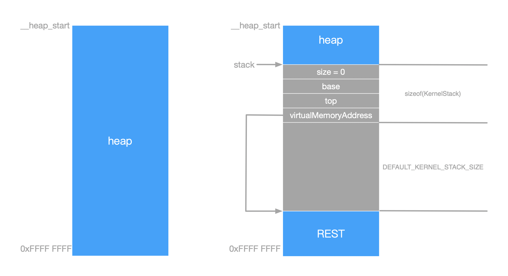

中文版

内核栈是内核线程创建时首先需要做的事情，在内存初始化页表后，剩余的所有物理空间都作为 `SynestiaOS` 的heap段，所以内核栈也都是在heap堆上分配出来的。本篇文档就介绍 `SynestiaOS ` 栈的使用。

内核栈的代码位于 `SynestiaOS/SourceCode/Kernel/include/kstack.h` 和 `SynestiaOS/SourceCode/Kernel/src/kstack.c` 中。


### 栈的基础数据结构：

```c
#define DEFAULT_KERNEL_STACK_SIZE 32 * KB

typedef uint32_t VirtualAddress;

typedef struct KernelStack {
  uint32_t size;
  VirtualAddress base;
  VirtualAddress top;
  VirtualAddress *virtualMemoryAddress;
} __attribute__((packed)) KernelStack;
```

- 内核栈的默认大小是32KB。
- 内核栈使用 `KernelStack` 来描述，size表示使用了的栈空间的大小；base是栈空间的起始地址(KernelStack的起始地址)，top保存栈顶的指针；


### 内核栈的建立：

```c
KernelStack *kstack_allocate() {
  // 1. allocate stack memory block from virtual memory (heap), and align.
  KernelStack *stack = (KernelStack *)kheap_alloc_aligned(DEFAULT_KERNEL_STACK_SIZE + sizeof(KernelStack), 16);
  if (stack == nullptr) {
    printf("[KStack] kStack allocate failed.\n");
    return nullptr;
  }
  stack->virtualMemoryAddress = (uint32_t *)(stack + sizeof(KernelStack) + DEFAULT_KERNEL_STACK_SIZE);
  stack->size = 0;
  stack->base = stack->virtualMemoryAddress;
  stack->top = stack->base;
  return stack;
}
```

- 在内存初始化页表后，剩余的所有物理空间都作为 `SynestiaOS` 的heap段，所以内核栈也都是在heap堆上分配出来的，分配的实际大小是 `DEFAULT_KERNEL_STACK_SIZE + 一个KernelStack的大小`，注意需要对齐
- 下来初始化栈的属性，栈的 virtualMemoryAddress 就是实际使用的栈内存的起始地址
- size设置为0 ，
- top指向栈顶，初始化的时候的栈顶是base。
- 建立完成之后内存布局如下：




### 压栈：

```c
KernelStatus kstack_push(KernelStack *stack, uint32_t data) {
  if (kstack_is_full(stack)) {
    return ERROR;
  }
  stack->top = stack->top - sizeof(uint32_t);
  *(uint32_t *)(stack->top) = data;
  stack->size += 1;
  return OK;
}
```

- 如果栈已满，则返回错误
- top字段是栈顶的指针，压栈就将top的地址向上移动4个字节。
- 之后压入数据data，将size属性加1。


### 出栈：

```c
uint32_t kstack_pop(KernelStack *stack) {
  if (kstack_is_empty(stack)) {
    return ERROR;
  }
  uint32_t val = *(uint32_t *)(stack->top);
  stack->top = stack->top + sizeof(uint32_t);
  stack->size -= 1;
  return val;
}
```

- 如果栈已经空了，就返回错误
- 使用中间变量val保存出栈的数据，之后将top指针加4个字节。
- 将size属性减1


### 清空栈：

注意这里是清空栈中的数据，而不是释放整个栈段。

```c
KernelStatus kstack_clear(KernelStack *stack) {
  stack->size = 0;
  stack->top = stack->base;
  return OK;
}
```

- 只需要把 `KernelStack` 的size和top重置就可以了，之前存放的数据就被认为是废弃的了。


### 释放栈：

```c
KernelStatus kstack_free(KernelStack *stack) {
  stack->size = 0;
  stack->base = 0;
  stack->top = 0;
  return kheap_free(stack);
}
```

- 这里是将整个栈进行释放，在分配栈的时候已经指出整个申请的堆的大小是 `DEFAULT_KERNEL_STACK_SIZE + sizeof(KernelStack)`，所以实际在内存上分配的大小是 `DEFAULT_KERNEL_STACK_SIZE + sizeof(KernelStack) + sizeof(HeapArea)`，释放的时候需要将这些内存全部释放掉。


### 其余的栈方法：

得到栈顶指针：

```c
uint32_t kstack_peek(KernelStack *stack) { return *(uint32_t *)(stack->top); }
```

判断栈是否为空：

```c
bool kstack_is_empty(KernelStack *stack) { return stack->top == stack->base; }
```

判断栈满：

```c
bool kstack_is_full(KernelStack *stack) { return stack->top == stack->base - DEFAULT_KERNEL_STACK_SIZE; }
```